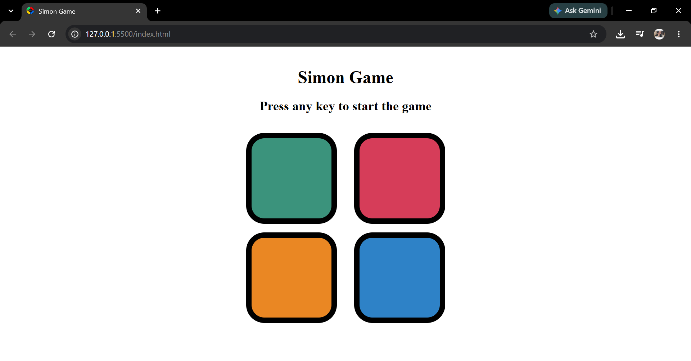

# Simon Game 🎮

A simple and interactive Simon Game built using HTML, CSS, and JavaScript.

The game tests your memory by generating a sequence of colors that you need to remember and repeat correctly. The sequence gets longer as you progress through the levels.

## 🎯 Features

- 🎨 Color-based Simon Game
- 🧠 Memory-based gameplay
- 📈 Increasing difficulty with each level
- ✨ Button animations and visual effects
- 📱 Responsive design for different screen sizes
- 🎮 Simple and user-friendly interface

## 🛠️ Technologies Used

- HTML
- CSS
- JavaScript

## 🎮 How to Play

1. Open the game using the Live Demo link below.
2. Press any key to start the game.
3. Watch the color sequence carefully.
4. Click the buttons in the same sequence.
5. Each successful round increases the level and adds a new color to the sequence.
6. If you click the wrong button, the game ends.

## 🌐 Live Demo

[Play the Simon Game](https://stutigupta1503.github.io/Simon-Game/)

## 📸 Preview

## 💻 Source Code

- [Source Code](https://github.com/stutigupta1503/Simon-Game)

## 👩‍💻 Author

**Stuti Gupta**

[GitHub](https://github.com/stutigupta1503)
[LinkedIn](https://www.linkedin.com/in/stuti-gupta1503/)

Built as a mini project to practice HTML, CSS, and JavaScript.
